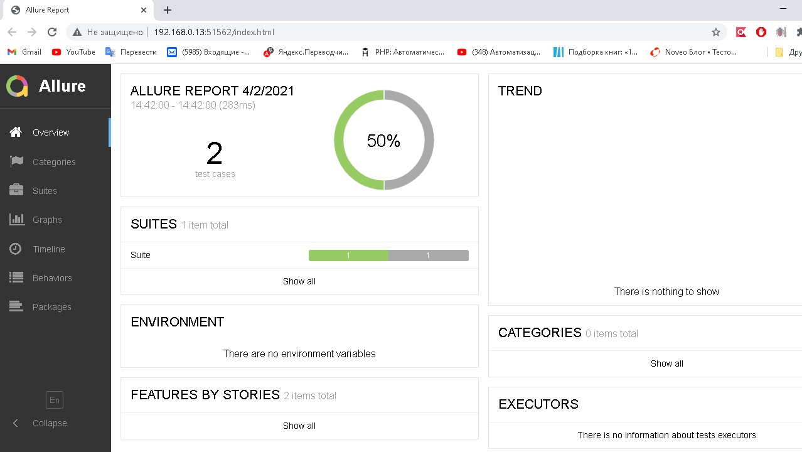

# TestMavenTestNG

1. Выполнить файл testng.xml
2. После прогона автотестов папка allure-results напонится результатами прогона
3. Что бы открыть результаты прогона в браузере в формате html необходимо
в командной строке выполнить команду allure serve *далее адрес до папки с отчетами в формате json allure-results *
allure serve C:\Users\kir9l\IdeaProjects\TestMavenTestNG\allure-results
   
Пример html отчёта в allure

 
